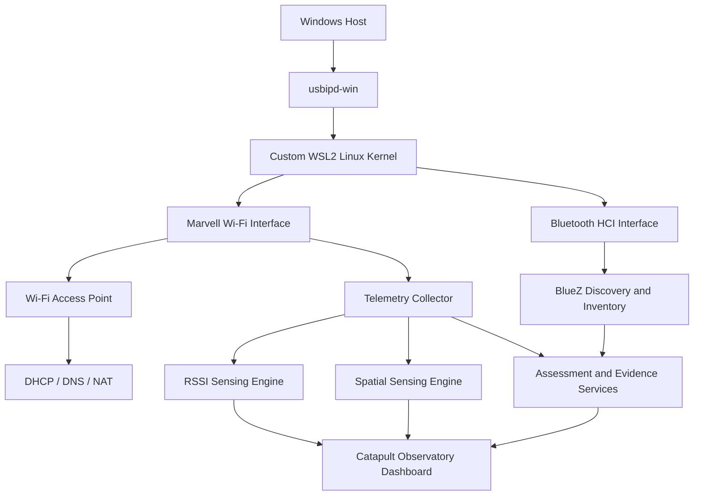

# Catapult Observatory

<p align="center">
  
</p>

<p align="center">
  <strong>A repurposed hotel-TV wireless module transformed into a local Wi-Fi, Bluetooth, RSSI-sensing, and wireless-assessment platform.</strong>
</p>

<p align="center">
  Built by <strong>SilentiumLabs</strong>
</p>

---

## Overview

Catapult Observatory began with a specialized USB wireless module originally intended for hotel television systems.

The module is based on the Marvell 88W8997 Wi-Fi and Bluetooth platform. Instead of leaving it limited to its original purpose, I rebuilt the surrounding software environment and developed a complete local wireless research platform around it.

This was not a plug-and-play project.

The build required:

- A custom WSL2 Linux kernel
- USB/IP passthrough from Windows into Kali Linux
- Marvell wireless driver integration
- Wi-Fi access-point configuration
- Bluetooth support through BlueZ
- DHCP, DNS, routing, and NAT services
- Local telemetry collectors
- RSSI-based sensing engines
- Experimental multi-link spatial sensing
- Local evidence and assessment workflows
- A browser-based control and visualization dashboard

The result is **Catapult Observatory**, a proof-of-concept platform for local wireless visibility, experimentation, device assessment, and signal-behavior analysis.

---

## Project Status

| Area | Status |
|---|---|
| Custom WSL2 kernel | Operational |
| USB/IP attachment | Operational |
| Marvell Wi-Fi interface | Operational |
| Wi-Fi access point | Operational |
| Bluetooth controller | Operational |
| Local dashboard | Operational |
| Wi-Fi station telemetry | Operational |
| Bluetooth discovery and inventory | Operational |
| RSSI movement sensing | Experimental |
| Multi-link zone sensing | Experimental |
| Device behavior intelligence | In active stabilization |
| Raw CSI | Not exposed by current driver |
| Monitor mode | Not exposed by current driver |

> **Important:** Catapult Observatory does not claim to identify people, reconstruct body pose, see through walls, or calculate exact physical coordinates. Its sensing features are based on measurable RSSI and station-telemetry changes exposed by the current driver.

---

## From This

A USB wireless module designed for a narrow embedded use case:

- Marvell 88W8997 chipset
- 2×2 802.11ac Wi-Fi
- Bluetooth and BLE support
- USB 2.0 interface
- Limited original software environment

## To This

A local platform supporting:

- Wi-Fi client visibility
- Bluetooth discovery
- Device inventory
- Signal and traffic history
- RSSI-based disturbance sensing
- Experimental multi-link zone sensing
- Performance measurements
- IoT assessment workflows
- Firmware before-and-after comparisons
- Evidence storage
- Findings and reporting
- Local-only processing

---

## Why This Build Was Difficult

The original hardware was not designed as a general-purpose Linux research adapter.

The work included:

1. Identifying the hardware and chipset
2. Building a custom WSL2 Linux kernel
3. Enabling the required USB and networking support
4. Passing the USB device from Windows into WSL with `usbipd-win`
5. Bringing the Marvell Wi-Fi and Bluetooth interfaces online
6. Creating a stable access-point stack
7. Building persistent recovery and service scripts
8. Collecting driver-exposed telemetry
9. Designing signal-processing and visualization layers
10. Keeping the platform honest about unsupported capabilities

---

## Custom Kernel Work

The standard WSL2 environment did not expose everything required to use the adapter as intended.

I built and deployed a custom Linux kernel:

```text
Linux 6.18.35.2-silentium-usb3+
```

The custom environment was configured for:

- WSL2 USB passthrough
- USB/IP support
- Marvell wireless hardware
- Wi-Fi access-point operation
- Bluetooth HCI support
- Linux routing and firewall features
- Local systemd services

The adapter is attached from Windows into Kali Linux using `usbipd-win`.

Once attached, the primary Wi-Fi interface appears inside Linux as:

```text
mlan0
```

---

## System Architecture



All primary processing and storage remain local.

---

## Core Components

### Windows host layer

- `usbipd-win`
- WSL2
- USB device attachment and recovery
- Browser access to the local dashboard

### Linux platform layer

- Kali Linux under WSL2
- Custom Linux kernel
- systemd services
- Marvell Wi-Fi driver
- Bluetooth HCI and BlueZ
- NetworkManager
- dnsmasq
- nftables

### Catapult application layer

- Python
- Flask
- JavaScript
- HTML and CSS
- SQLite
- Server-Sent Events
- Local JSON state snapshots
- systemd-managed background engines

---

## Wi-Fi Intelligence

Catapult Observatory can organize supported Wi-Fi station telemetry, including:

- Connected client inventory
- Signal strength
- Average signal measurements
- Received and transmitted bytes
- Packet counters
- Client inactivity
- Transmission rate
- MCS information
- Failed transmissions
- Latency and jitter measurements
- Connection history
- Endpoint-change observations

The platform is designed to show what was actually measured rather than inventing unsupported values.

---

## Bluetooth Intelligence

The Bluetooth workspace uses Linux BlueZ services to provide:

- Nearby-device discovery
- Address-type classification
- Device-name inventory
- Pairing status
- Bonding status
- Trust status
- Connection status
- Service UUID inventory
- Advertisement history
- Privacy exposure observations
- Read-only GATT inspection for approved devices
- Wi-Fi and Bluetooth coexistence testing

---

## RSSI-Based Sensing

Catapult Observatory includes experimental movement and radio-disturbance sensing using measurements exposed by the Wi-Fi driver.

The sensing engine analyzes:

- RSSI variation
- Signal span
- Short-term change
- Medium-term change
- Baseline deviation
- Measurement persistence
- Traffic freshness
- Feature agreement
- Endpoint movement

Possible states include:

```text
QUIET
BUILDING
DISTURBANCE
MOVEMENT
SUSTAINED ACTIVITY
SETTLING
ENDPOINT SHIFT
LOW QUALITY
```

The visualization represents signal-derived activity. It does not claim to display a physical person or exact location.

---

## Motion Lens

Motion Lens converts sensing measurements into a live visual representation of radio-path activity.

It includes:

- Motion volume
- Radio-path visualization
- Temporal echoes
- Movement onset and decay
- Confidence indicators
- Data-quality indicators
- Session holding
- Frame export
- Full-screen visualization

Visual intensity is reduced when measurement quality or confidence is low.

---

## Spatial Lab

Spatial Lab combines measurements from multiple stationary Wi-Fi clients.

Each reference device creates a separate radio path between itself and the Catapult access point.

With several calibrated reference devices, the platform can estimate:

- Probable activity zone
- Zone likelihood
- Movement transitions
- Per-link disturbance strength
- Coverage quality
- Measurement confidence
- Reference-device movement
- Session history

These results are probabilistic zone estimates, not exact physical coordinates.

---

## IoT and Firmware Assessment

The platform supports controlled assessment workflows for owned or authorized devices.

Example workflow:

```text
Device Baseline
      ↓
Firmware Before Snapshot
      ↓
Firmware Update
      ↓
Firmware After Snapshot
      ↓
Service, privacy, and behavior comparison
```

The comparison workflow can record changes involving:

- Local services
- Network destinations
- Connection behavior
- Signal behavior
- Bluetooth exposure
- Performance measurements
- Privacy observations

---

## Performance Laboratory

Supported performance tests include:

- Client latency
- Packet loss
- Jitter
- DNS resolution time
- TCP connection time
- Device-by-device comparison
- Wi-Fi-only baseline
- Bluetooth coexistence testing

Unsupported measurements are marked unavailable instead of being estimated.

---

## Assessment, Evidence, and Reporting

Catapult Observatory includes local workflows for:

- Scope records
- Authorized assets
- Service validations
- Bluetooth validations
- Findings
- Evidence storage
- Evidence hashing
- Assessment timelines
- CSV exports
- JSON exports
- Printable reports

---

## Local Processing and Privacy

The platform may store supported metadata such as:

- Wireless station counters
- DHCP lease information
- Network connection metadata
- Bluetooth observations
- Performance measurements
- Sensing sessions
- Assessment evidence

It is not designed to collect:

- Passwords
- Credentials
- Decrypted HTTPS content
- Private messages
- Transferred files
- Application payload contents

No cloud processing is required.

---

## Screenshots

### Main dashboard

<p align="center">
  
</p>

### Motion Lens

<p align="center">
  
</p>

### Spatial Lab

<p align="center">
  
</p>

### Bluetooth workspace

<p align="center">
  
</p>

> All public screenshots should be sanitized before upload. Remove or blur MAC addresses, private IP addresses, personal device names, Bluetooth identities, private DNS destinations, and local system information.

---

## Repository Structure

```text
catapult-observatory/
├── README.md
├── SECURITY.md
├── docs/
│   ├── architecture.md
│   ├── hardware.md
│   ├── kernel-build.md
│   ├── sensing.md
│   ├── limitations.md
│   ├── privacy-and-responsible-use.md
│   └── images/
│       ├── catapult-overview.png
│       ├── hardware-module.jpg
│       ├── dashboard-overview.png
│       ├── motion-lens.png
│       ├── spatial-lab.png
│       └── bluetooth-workspace.png
└── .gitignore
```

---

## Documentation

- [Architecture](docs/architecture.md)
- [Hardware](docs/hardware.md)
- [Custom Kernel and WSL2 Integration](docs/kernel-build.md)
- [RSSI and Spatial Sensing](docs/sensing.md)
- [Limitations](docs/limitations.md)
- [Privacy and Responsible Use](docs/privacy-and-responsible-use.md)
- [Security Policy](SECURITY.md)

---

## Hardware and Driver Limitations

The current adapter and Linux driver expose managed, access-point, and P2P operation.

They do not expose:

- Monitor mode
- Raw Channel State Information
- Per-antenna CSI phase data
- Passive 802.11 frame capture
- Exact physical positioning
- Body-pose reconstruction
- Person identification
- True RF imaging

Catapult Observatory therefore does not claim to see people through walls or determine exact room coordinates.

Its sensing features use measurable RSSI and station-telemetry changes.

---

## Responsible Use

Catapult Observatory is intended for:

- Hardware experimentation
- Owned-device testing
- Authorized wireless research
- IoT evaluation
- Local network assessment
- Educational use

Testing should only be performed on devices, hardware, and networks you own or are explicitly authorized to assess.

---

## Author

**Silentium**  
Founder, SilentiumLabs

GitHub: [silentiumlabsio](https://github.com/silentiumlabsio)

---

## Source Availability

The full Catapult Observatory application remains private.

No open-source license is currently granted. Unless otherwise stated, the project design, interface, documentation, branding, and private source code remain the property of SilentiumLabs.

Copyright © 2026 SilentiumLabs. All rights reserved.
