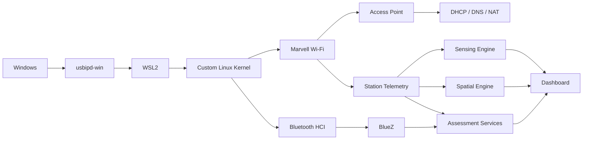

# Catapult Observatory Architecture

## Purpose

This document describes the high-level architecture of Catapult Observatory.

The platform was built around a repurposed Marvell 88W8997 USB wireless module attached to Kali Linux running under WSL2.

## High-Level Flow

## Windows Layer

The Windows host provides:

- WSL2
- USB attachment through `usbipd-win`
- Browser access to the dashboard
- Recovery scripts for reconnecting the USB device after a reboot or WSL restart

## Linux Layer

The Linux environment provides:

- Kali Linux
- Custom WSL2 kernel
- Marvell wireless support
- Bluetooth HCI support
- systemd
- NetworkManager
- dnsmasq
- nftables
- BlueZ

## Network Layer

The Marvell interface is used as a local Wi-Fi access point.

Typical components include:

- Wi-Fi interface: `mlan0`
- Local gateway address: `10.42.0.1`
- DHCP and local DNS
- NAT through nftables
- Local dashboard access over port `8080`

## Catapult Services

### Observatory collector

Collects supported system and wireless telemetry.

### Sensing engine

Processes single-link RSSI behavior and movement-related disturbance measurements.

### Spatial engine

Combines multiple stationary reference links for experimental zone estimation.

### Dashboard service

Provides the browser interface and local APIs.

### Intelligence layer

Organizes longer-term observations, device history, and assessment context. This layer is under active stabilization.

## Data Storage

Catapult Observatory uses local storage such as:

- SQLite databases
- JSON state snapshots
- Local evidence directories
- Session histories
- Exported CSV, JSON, and printable reports

No cloud backend is required.

## Security Boundaries

The platform is designed around:

- Local-only processing
- Authorized devices and networks
- No credential collection
- No decrypted HTTPS inspection
- Read-only Bluetooth inspection unless a user explicitly approves another action
- Clear separation between measured facts and experimental inference
